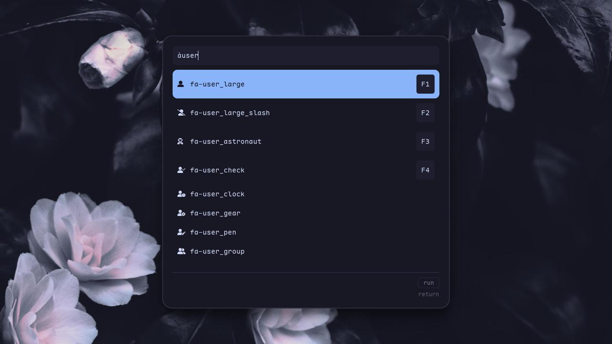

# Walker Nerd Icons Menu



Custom [Walker](https://github.com/abenz1267/walker) provider for searching Nerd Font glyphs and copying the selected icon to clipboard.
Built as a custom [elephant's menus](https://github.com/abenz1267/elephant/tree/master/internal/providers/menus).

## Prerequisites

- [Walker](https://github.com/abenz1267/walker)
- [Elephant](https://github.com/abenz1267/elephant) with `menus` provider
- `wl-copy` (from `wl-clipboard`) for clipboard copy
- At least one of `curl` or `wget` (used by the menu to fetch `glyphnames.json` when missing)

## Installation

```bash
git clone https://github.com/nino-mau/elephant-nerd-font
cd elephant-nerd-font
./install.sh
```

The installer copies `nerd-icons.lua` to:

`~/.config/elephant/menus/nerd-icons.lua`

## Walker setup

Add a prefix in your Walker config (`~/.config/walker/config.toml`):

```toml
[[providers.prefixes]]
prefix = "$" # Can be anything
provider = "menus:nerd-icons"
```

Restart Walker and Elephant after configuration.

## Usage

- Launch walker
- Type your prefix (`$`) followed by a query
- Search by icon name (example: `cod-arrow`)
- Press `Enter` to copy the glyph

> [!TIP]
> You can launch the menu directly with `walker --provider menus:nerd-icons`

## Data source

Glyph metadata is loaded from:

1. Local Nerd Fonts `glyphnames.json` paths (if found)
2. Cached file in `~/.cache/elephant/nerd-icons/glyphnames.json`
3. Nerd Fonts upstream `glyphnames.json` URL
